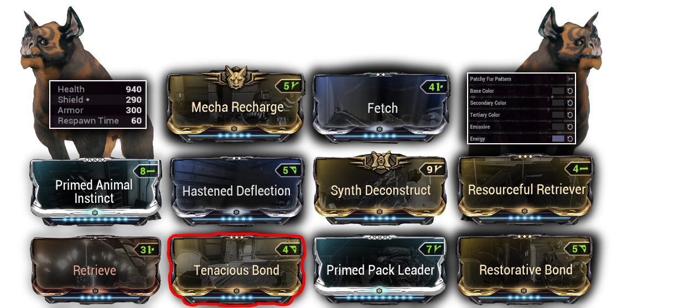

# <u> Companion </u>

**The beast Companions** can also increase your earnings with their mods, which are as follows ;
- One mod that can double your resources
- One whome double credits
- One that can double both, but with a lower percentage. 
We can use these mods on all beasts companions, but we can only equip one mod at a time.

    

> [!NOTE]
>-  The one that will interest us the most is [Resourceful Retriever], which gives an 18% chance to double pickups.
>- Since the nerf to Smeeta and its [*__Charm__*](https://warframe.fandom.com/fr/wiki/Charme) mod, the companion that now makes the most sense to use is the **Chesa Kubrow**.

## <u> Chesa Kubrow </u>

### <u> Chesa Build </u>

- **“Retrieve”** is a Kubrow exclusive mod that allows the Chesa Kubrow to retrieve additional items from enemy corpses or containers
- **Additional loot retrieval stacks with other loot abilities that loot on death** (*Khora Pilfering Strangledome*), however, it does <u> **not stack with other loot corpse abilities Nekros "Desecrate"** </u>
- **“Calculated Redirection”** to activate **“Reinforced Bound”**

    

<u> *A quick clarification regarding Nekros and the Chesa Kubrow* : </u>

::: info
It is true that Nekros  [**__Desecrate__**](https://warframe.fandom.com/wiki/Desecrate)  and the [**__Chesa's Retrieve__**](https://warframe.fandom.com/wiki/Retrieve) ability <u> do not directly stack on the same corpse. </u>

In other words, an enemy cannot be "doubly" looted by both abilities.
However, these two abilities remain <u> **complementary** : </u>

 [**__Desecrate__**](https://warframe.fandom.com/wiki/Desecrate) cannot trigger on every enemy (e.g., if the corpse disappears too quickly or has already been affected).

This is where the Chesa comes into play ; it can activate [**__Retrieve__**](https://warframe.fandom.com/wiki/Retrieve) on the corpses that **Nekros** might have missed.

Even with two Nekros in the squad, <u> it’s impossible to hit 100% of the corpses in all situations. </u>

Conclusion:
Using a Chesa alongside a Nekros can improve <u> overall loot coverage </u>, without increasing the chances per corpse, but <u> reducing potential losses </u>.
:::

### <u> Claw build </u>

    

## <u> Venari </u>

    

    

