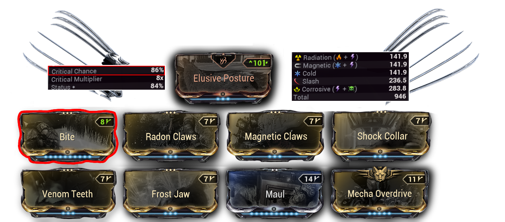
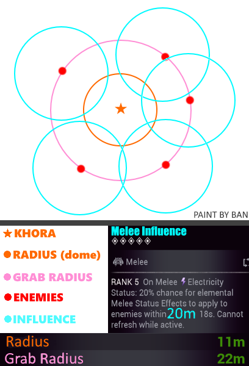
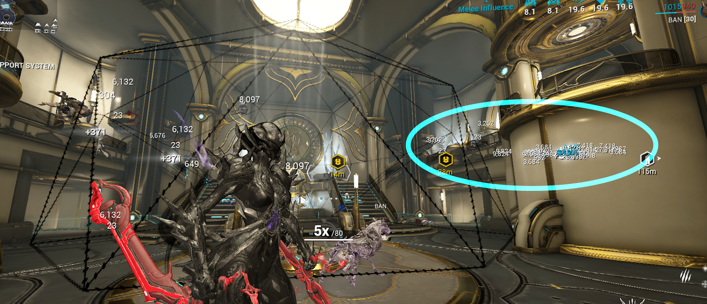

#  <u> <strong> Khora Steel Path </strong> </u>

## <u> <strong> Steel Path Build 1 </strong> </u>

⭐ <u> <strong> **Lycath’s Hunt**</strong> </u> : enemy killed by melee attacks (whipclaw) has a 50% chance to drop a Health Orb ( equilibrium synergie), enemy directly killed headshot hits has a 50% chance to drop an Energy Orb. Kill an enemy affected by at least 5 Status Effects to extend Lycath's Hunt's remaining duration, 

 - **We can replace** : Brief Respite per [**__Corrosive Projection__**](https://warframe.fandom.com/wiki/Corrosive_Projection)

- Equilibrium / Primed Flow for energies 
-  Stretch / Overextended - **235 range**

 - **We can replace** : [**__Stretch__**](https://warframe.fandom.com/wiki/Stretch) per [**__Augur Reach__**](https://warframe.fandom.com/wiki/Augur_Reach) for Augur SET synergies - **220 range**

  

➛ **Naramon Focus** : *Power Spike* — Melee Combo Counter now decays while out of combat by 5 every few seconds instead of depleting completely.  
*Opening Slam* — Performing a Slam as Operator switches to Warframe and grants double combo gain for 20 sec.  

➛ **Arcane** :  
- [**__Molt Augmented__**](https://wiki.warframe.com/w/Molt_Augmented) (40% → 100%)  
- [**__Molt Efficiency__**](https://wiki.warframe.com/w/Molt_Efficiency) (more Duration)  
- [**__Arcane Fury__**](https://wiki.warframe.com/w/Arcane_Fury) (more melee damage)  

➛ **Archon Shard** : 5× Critical Damage — Deal more damage.

## <u> <strong> Steel Path Build 2 </strong> </u> 

  

⭐ [**__Wrathful Advance__**](https://wiki.warframe.com/w/Wrathful_Advance) : The bonus critical chance also applies to **Exalted Weapons**, including formerly pseudo-exalted ones.  

➛ We don't need **Lycath Hunt** or **Spectrosiphon**, as we already recover plenty of energy through Nekros' **Desecrate** and Nova’s fourth ability.  

➛ In my opinion, this build is much more **effective** — it deals more damage to enemies, including Acolytes and Eximus units.  

➛ This makes [**__Arcane Vortex__**](https://wiki.warframe.com/w/Melee_Vortex) a viable option.  

➛ [**__Archon Continuity__**](https://wiki.warframe.com/w/Archon_Continuity) applies a Corrosive status effect in addition to Toxin and Magnetic (in a Vortex build), which synergizes well with [**__Condition Overload__**](https://wiki.warframe.com/w/Condition_Overload).  

➛ The *Mecha* set is situational but still interesting for the reasons mentioned above.

## <u> <strong> Whipclaw </strong> </u>

:::info
Since [**__Update 38.5__**](https://forums.warframe.com/topic/1442589-update-385-techrot-encore/) 
 there has been a change to Exalted Weapons. I invite you to read the patch notes to see all the details.
:::

### <u> <strong> Basically </strong> </u>

- Whipclaw is now Khora's own Exalted weapon, which can be modded like a melee weapon.
- New "Ability Combo Counter" has been introduced, specifically for Pseudo-Exalted weapons. 
- Melee weapons no longer have any impact on Whipclaw (modding, Incarnon, Valence bonuses, etc.).
- Galvanized, Bane, Statut Damage , CO... mods now work on Whipclaw.
- Arcane Fury and Avenger are still compatible with Whipclaw.

## <u> <strong> Vortex </strong> </u>

Vortex will create a vortex that pulls mobs into your cage.
 - This build synergizes with the [Khora Steel Path 2 Build](./khoraSteelPath.md).
 - It triggers [**__Primed Continuity__**](https://wiki.warframe.com/w/Primed_Continuity) for status, which synergizes with [**__Condition Overload__**](https://wiki.warframe.com/w/Condition_Overload) (CO).
 - This build requires the [**__Epitaph__**](https://wiki.warframe.com/w/Epitaph) to apply multiple status effects (for CO), but most importantly to proc Magnetic, which makes the Arcane work 

 You can still play it without the [**__Epitaph__**](https://wiki.warframe.com/w/Epitaph) — just equip the [**__Magnetic Rush__**](https://wiki.warframe.com/w/Magnetic_Rush) mod. 

  

## <u> <strong> Exposure </strong> </u>

- This is the most classic and versatile build.
- You can do all your *farming sessions with this build*
- You just need to *adapt your Smite*

  

## <u> <strong> Influence  </strong> </u>

### <u> <strong> **DO NOT USE FOR FARMING**  </strong> </u> 

  

:::info 
- Influence will kill enemies outside the cage, so they won't benefit from [**__Pilfering Strangledome__**](https://wiki.warframe.com/w/Pilfering_Strangledome)
- However, **Influence** is fun to play for general use.

  

