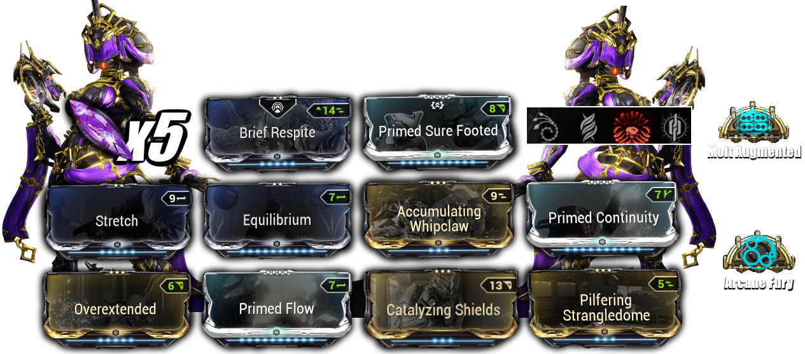
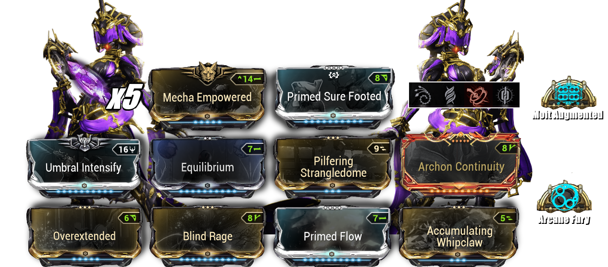

#  <u> <strong> Khora Steel Path </strong> </u>

## <u> <strong> Steel Path Build 1 </strong> </u>

⭐ **Lycath’s Hunt** : enemy killed by melee attacks (whipclaw) has a 50% chance to drop a Health Orb ( equilibrium synergie), enemy directly killed headshot hits has a 50% chance to drop an Energy Orb. Kill an enemy affected by at least 5 Status Effects to extend Lycath's Hunt's remaining duration, 

 - **We can replace** : Brief Respite per [**__Corrosive Projection__**](https://warframe.fandom.com/wiki/Corrosive_Projection)

- Equilibrium / Primed Flow for energies 
-  Stretch / Overextended - **235 range**

 - **We can replace** : [**__Stretch__**](https://warframe.fandom.com/wiki/Stretch) per [**__Augur Reach__**](https://warframe.fandom.com/wiki/Augur_Reach) for Augur SET synergies - **220 range**

  

➛ **Naramon Focus** : *Power Spike* — Melee Combo Counter now decays while out of combat by 5 every few seconds instead of depleting completely.  
*Opening Slam* — Performing a Slam as Operator switches to Warframe and grants double combo gain for 20 sec.  

➛ **Arcane** :  
- *Molt Augmented* (40% → 100%)  
- *Molt Efficiency* (more Duration)  
- *Arcane Fury* (more melee damage)  

➛ **Archon Shard** : 5× Critical Damage — Deal more damage.

## <u> <strong> Steel Path Build 2 </strong> </u> 

  

⭐ **Wrathful Advance** : The bonus critical chance also applies to Exalted Weapons, including formerly pseudo-exalted ones.  

➛ We don't need *Lycath Hunt* or *Spectrosiphon*, as we already recover plenty of energy through Nekros' *Desecrate* and Nova’s fourth ability.  

➛ In my opinion, this build is much more effective — it deals more damage to enemies, including Acolytes and Eximus units.  

➛ This makes *Arcane Vortex* a viable option.  

➛ *Archon Continuity* applies a Corrosive status effect in addition to Toxin and Magnetic (in a Vortex build), which synergizes well with *Condition Overload*.  

➛ The *Mecha* set is situational but still interesting for the reasons mentioned above.

