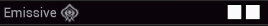
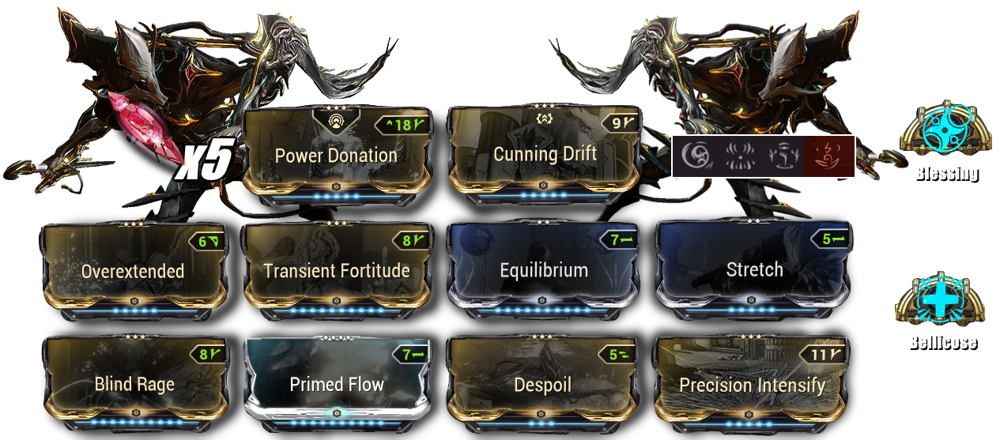
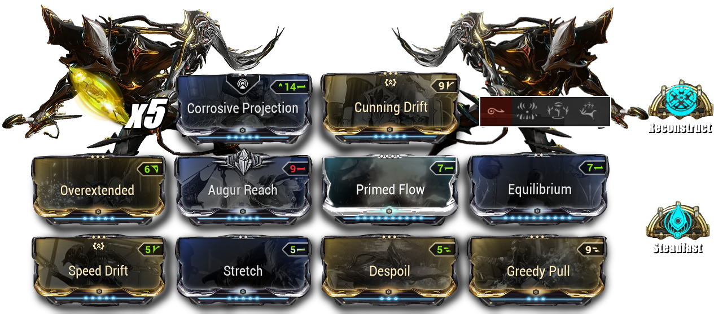

# <u> <strong> Nekros OS/SP </strong> </u>

## <u> <strong> Rage </strong> </u>

⭐ <u> <strong>  **Rage SUBSUME** </strong> </u>
A target affected by Rage has its speed increased and becomes more vulnerable to damage
**Use a light color to apply Rage; otherwise, you will put enemies to sleep instead of speeding them up**
 
 

   
 

- **DESPOIL MANDATORY** 
-  Overextended,Stretch,Cunning Drift ➛ **HIGH RANGE**
-  Corrosive Projection to reduce the armor 
     ➛ We can replace per : Steel Charge / Melee Guidance / Growing Power
-  **Equilibrium** / **Primed Flow** for energies 
-  Precision Intensify,Blind Rage,Transient Fortitude ➛ **Rage Powe**r** 
     ➛  *Replace the fourth ability with Rage to gain even more power through Precision Intensify*

 

   
 

- **Madurai Focus** : Sling Strength ( 40 % Ability Strength on switching to frame after void slings )
- **Arcane** : [**__Arcane Power Ramp__**](https://wiki.warframe.com/w/Arcane_Power_Ramp) / 
               [**__Arcane Steadfast__**](https://wiki.warframe.com/w/Arcane_Steadfast)(Energy efficiency)
- **Archon Shard** 5x Red Ability Strength

##  <u> <strong> Pull </strong> </u>

⭐ <u> <strong>  **Pull SUBSUME**</strong> </u> : Pull will be used to grab the mobs and put them in the khora cage.

<u> <strong> DESPOIL MANDATORY </strong> </u>

- **Overextended,Stretch,Cunning Drift,Augur Reach** ➛ **VERY HIGH RANGE**
- **Corrosive Projection** to reduce the armor 
    
    ➛ We can replace per : **Steel Charge / Melee Guidance / Power Donation**
-  **Equilibrium / Primed Flow** for energies 
- **Speed Drift** ➛ **Casting Speed** / **Sprint Speed**

    ➛ We can replace per : **Natural Talent / Fire Walker**…

   

- **Madurai Focus** :  **Power transfer** ( 50 % Casting speed on switching to frame ) 
- **Arcane** : [**__Molt Reconstruct__**](https://wiki.warframe.com/w/Molt_Reconstruct) / 
               [**__Arcane Steadfast__**](https://wiki.warframe.com/w/Arcane_Steadfast)(Energy efficiency)

- **Archon Shard** 3x Yellow **Casting Speed** 2x Yellow **Parkour Velocity**   

## <u> <strong> Petrify </strong> </u> 

⭐  <u> <strong>  **Petrify Subsume**</strong> </u> :Augment Ore Gaze  *Petrified enemies are scanned into the Codex and have a 25% chance to drop additional loot when killed*.

### <u> <strong> Additional loot retrieval stacks with other loot abilities </strong> </u> 
### <u> <strong> Khora StrangleDome / Nekros Desecrete / Chesa Retrieve </strong> </u> 
*with the following build we can go up to 100%*

   

- <u> <strong> **DESPOIL MANDATORY** </strong> </u>
- **Overextended ,Cunning Drift** ➛ ok RANGE ( 47.5m Radius Desecrate )
- **Corrosive Projection** to reduce the armor 
     ➛ We can replace per : **Steel Charge / Melee Guidance / Growing Power**
- **Equilibrium / Primed Flow** for energies 
-  **Precision Intensify,Blind Rage,Transient Fortitude** ➛ Drop Chance ⇗
     ➛  **Replace the fourth ability with Petrify to gain even more power through Precision Intensify**

   

