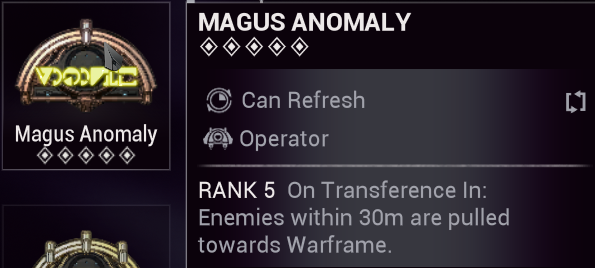
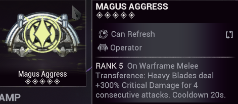

## <u> <strong> Operator </strong> </u> 

### <u> <strong> Magus Anomaly </strong> </u>

   

:::info
Very often it's the host who uses the Magus Anomaly to avoid too many problems, but there's nothing stopping others from using it too. The Magus states: upon Transference in, enemies are pulled towards your Warframe within a radius of 30m, which is very useful when enemies are hidden behind an obstacle or remain stuck in certain places because your Kavat is trying to attack them.

To spam your Transference, simply press your Transference key (by default it's the "5" key) followed by a melee attack, and repeat this procedure.
:::

### <u> <strong> Magus Agress </strong> </u> 

   

**Magus Aggress** , on Warframe Melee Transfer, causes Heavy Blades and Hammers ( **Magistar** ) to deal bonus Critical Multiplier for the next 4 attacks, with a 20 second cooldown. 

This Magus will only be used for  [Magistar Acolyte Killer](./weapons.md)

