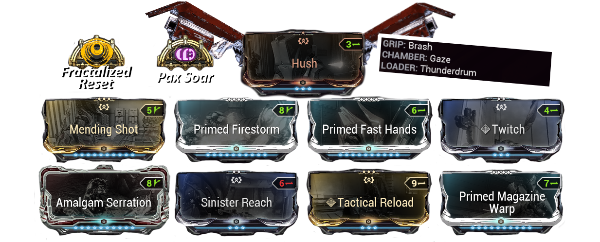
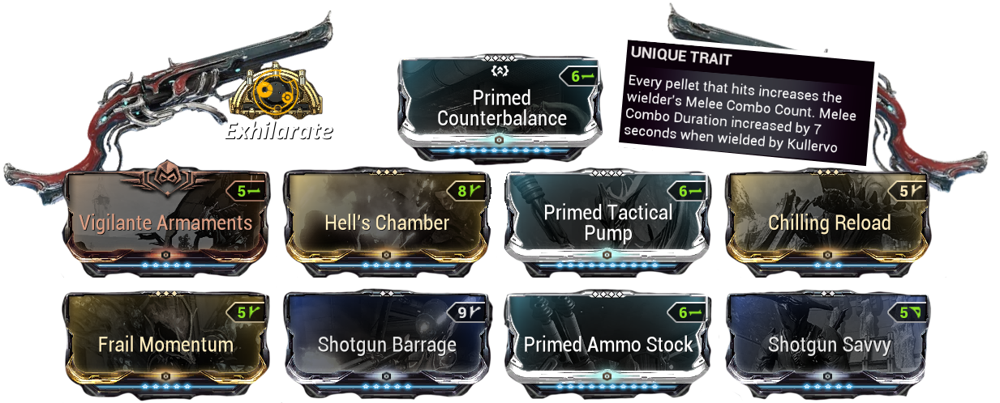
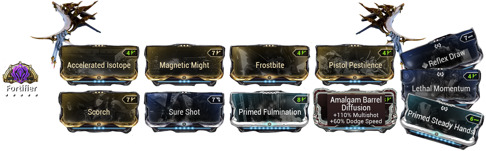
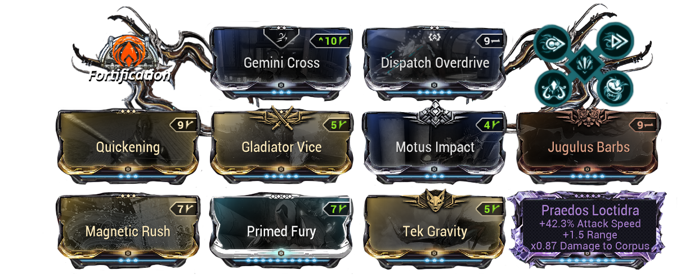
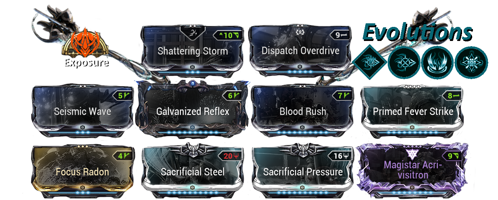

# <u> <strong> Weapons </strong> </u> 

## <u> <strong> Primary  </strong> </u> 

In 99% of cases, primary and secondary weapons will not be useful; they will mainly serve a utility role (arcane combo duration / utility mods)

### <u> <strong>  Gaze </strong>  </u>

   
 

:::info  
Primary Gaze will be used to proc [**__Mending Shot__**](https://warframe.fandom.com/wiki/Mending_Shot) and will be almost always useful since **Khora** will loot health orbs with **Lycath + Nekros** [**__Desecrates__**](https://warframe.fandom.com/wiki/Desecrate).

 It also works well with the [**__Glaxion__**](https://wiki.warframe.com/w/Glaxion)
This synergizes very well with [**__Equilibrium__**](https://wiki.warframe.com/w/Equilibrium); you'll never run out of energy
:::

### <u> <strong> Rauta </strong> </u>  

   
 

 Rauta  increases the equipped melee weapon's *Melee Combo Count with each pellet* that lands on an enemy.

  **Very useful for building up your combo counter with the [**__Magistar__**](https://warframe.fandom.com/fr/wiki/Magistar):

- **Multishot** is a key stat to quickly increase your combo count
- **Fire Rate** is also important to speed up combo count
- **Accuracy** is essential for comfort  it makes the Rauta more precise, which helps maintain your combo at longer ranges
- **Reload Speed** improves overall quality of life (QoL)  

## <u> <strong> Secondary </strong> </u> 

In 99% of cases, primary and secondary weapons will not be useful; they will mainly serve a utility role (arcane combo duration / utility mods)

### <u> <strong> Epitaph  </strong> </u> 

   

:::info
**Epitaph** will be used to prime enemies so they take more damage from [Whipclaw](./khoraSteelPath.md).
It synergizes with [**__Arcane Vortex__**](https://warframe.fandom.com/wiki/Melee_Vortex) since you’re dealing Magnetic (Magnetic Might).

It also **synergizes** with [**__Condition Overload__**](https://wiki.warframe.com/w/Condition_Overload) due to the number of status effects you’ll be applying.
[**__Amalgam Barrel Diffusion__**](https://warframe.fandom.com/wiki/Amalgam_Barrel_Diffusion) helps you move faster.

**Fortifer  Steal Overguard**
or
[**__Secondary Dexterity__**](https://wiki.warframe.com/w/Secondary_Dexterity) For the 7.5 second combo duration for [Khora](./khoraOrigin.md).
:::

## <u> <strong> Melee </strong> </u> 

:::warning

 [**__RIPKAS__**](http://wiki.warframe.com/w/Ripkas) **DOES NOT WORK WITH DOME + WHIPCLAW**
:::

 ### <u> <strong> Praedos  </strong> </u>

   

**Praedos** are probably the best utility weapon. Incarnon evolutions give you 20% sprint speed and 30% movement speed. The weapon must be equipped on [Nekros](./nekrososSp.md) and [Nova](./novaosSp.md) and [Khora OS](./khoraOrigin.md) / [Khora SP](./khoraSteelPath.md)

   

### <u> <strong> Magistar </strong> </u> 

<u> <strong> Classic Acolytes Killer </strong> </u> 

   

* il manquera une video a rajouter* en dessous faudra allez voir 

