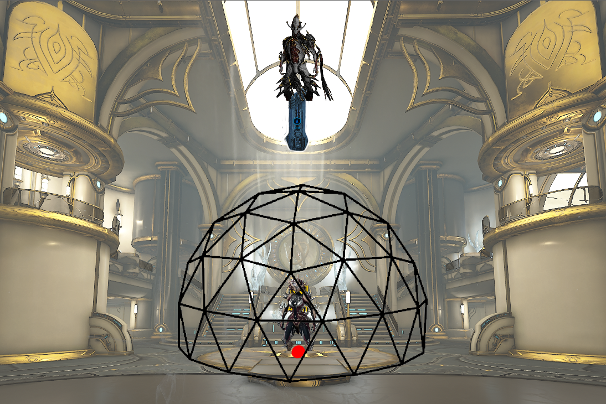
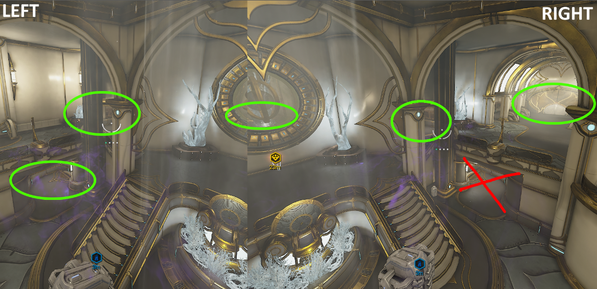
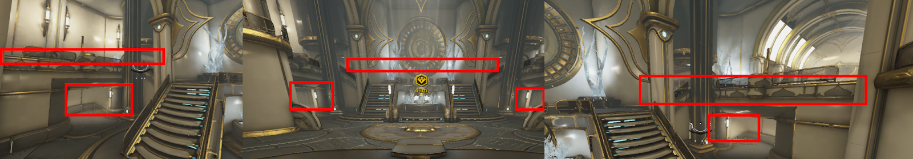

# <u> <strong> Ferrite </strong> </u>  

## <u> <strong> Ani/Mot - Void - Survival - Origin System/ Steel Path/ Relic </strong> </u>

- **Squad:** 4/4  
- **Composition:** 1 [Khora](../builds/khoraSteelPath.md) · 1 [Nova](../builds/novaosSp.md) · 2 [Nekros](../builds/nekrososSp.md)

   

:::details
Ani will be the mission to farm Ferrite. It’s very interesting because the mission can appear as a fissure, allowing us to farm Steel Essence at the same time.

I recommend **Mot**, but **only in SP fissure**, 
where you'll farm both the essences and the prime parts at the same time
 it is also located in the Void and has a fissure of its own. 

The notable difference is that;
- While farming OS, we won’t be able to one-shot the enemies in Mot. 
- The second difference is that we encounter Nullifiers there, which is very problematic as they are not affected by spells

:::

### <u> <strong> Tile Sets (Both map are the same) </strong> </u> 

We have **2 possible tiles**, shown below.  
When you spawn into the mission,
-  **if you're in the room from the second image, congratulations, you’ve got the right tile**. 
-  **If you’re in the one from the first image, restart the mission**.

   

### <u> <strong> Method Origin System </strong> </u> 

Once you've found the right tile, activate the alarm and proceed to the small room at the bottom of the stairs on the right (indicated by a circle on the image)

   

The method remains very basic. [Khora](../builds/khoraOrigin.md) will need to place her cage at this spot (indicated by the red circle).  
Then, the rest of the squad will stay in the small room and activate their respective spells.
You will need to collect some loot located at the entrance of the room. Leave the room to retrieve them, then quickly return so that the mobs keep moving into the cage  

   

:::tip

For [Nekros Rage](../builds/nekrososSp.md#rage) can use “Rage” (Helminth) on certain textures that the game considers transparent, which is useful for boosting enemies without having direct line of sight on them

   

:::

### <u> <strong> Position - Role </strong> </u> 

[Khora](../builds/khoraOrigin.md) is the main source of DPS and loot. 
- Kill enemies with her cage in the **Origin System**
- Place her cage in the right spots,
- Set Venari to 'Heal' on an ally to prevent them from running around and blocking enemies

[Nova](../builds/novaosSp.md) will increase the speed of the enemies so they run directly into Khora's cage. 
 - Press 4 to boost the mobs' speed, and that's it. 
-  Can spam [Magus Anomaly](../builds/operator.md#magus-anomaly) 
-  Use the Helminth ability she has equipped (quiver, rage).

[Nekros](../builds/nekrososSp.md) allows us to re-loot killed enemies with his ability **Desecrate**, thus increasing our resource gains.
- Nekros will use his 3 (Desecrate) and his Helminth ability, Rage, to increase the speed of the enemies and their vulnerability to damage.

### <u> <strong> Method Steel Path  </strong> </u> 

[Khora](../builds/khoraSteelPath.md) will position herself exactly as shown in the screenshot (red dot). 
[Nova](../builds/novaosSp.md) will place her Med-Tower. 
[Nekros](../builds/nekrososSp.md) will stand on the Med-Tower to have a clear view of the spawns. 
[Nova](../builds/novaosSp.md) will use Cloak to make the Nekros invisible so they are not targeted by the mobs.

   

*Mob Spawn Location Nekros POV* 

   

*Tower placement for nova* 

- Double Jump
- AimGlide - Down
- Press Antimatter keybind
- Press Medtower keybind

> TODO : AJOUTER LA VIDEO DE LA MED TOWER ANI 

:::tip
For  [Nekros Rage](../builds/nekrososSp.md#rage) can use “Rage” (Helminth) on certain textures that the game considers transparent, which is useful for boosting enemies without having direct line of sight on them

   

:::

### <u> <strong> Position Role </strong> </u> 

[Khora](../builds/khoraSteelPath.md) is the main source of DPS and loot. 
- kill enemies with the whip in SP (Steel Path).
- Place her cage in the right spots,
- Set Venari to 'Heal' on an ally to prevent them from running around and blocking enemies

[Nova](../builds/novaosSp.md) will increase the speed of the enemies so they run directly into Khora's cage. 

- Press 4 to boost the mobs' speed, and that's it. 
- Can spam [Magus Anomaly](../builds/operator.md#magus-anomaly) 
- Place the med tower for the Nekros.
- Put a cloak on the med tower to make the Nekros invisible and prevent enemies from targeting them).

[Nekros](../builds/nekrososSp.md) allows us to re-loot killed enemies with his ability **Desecrate**, thus increasing our resource gains.

 - Cast third ability  (Desecrate) and his Helminth ability, 
 - Can use Pull to bring the enemies into the cage or to unstick them.
- Alternatively, Rage, to increase the speed of the enemies and their vulnerability to damage.
It is always preferable to have one [Nekros Pull](../builds/nekrososSp.md#pull) and one [Nekros Rage](../builds/nekrososSp.md#rage) in the team