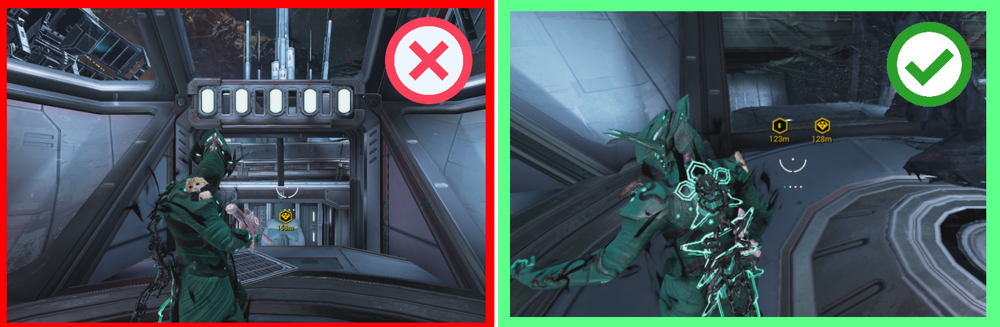
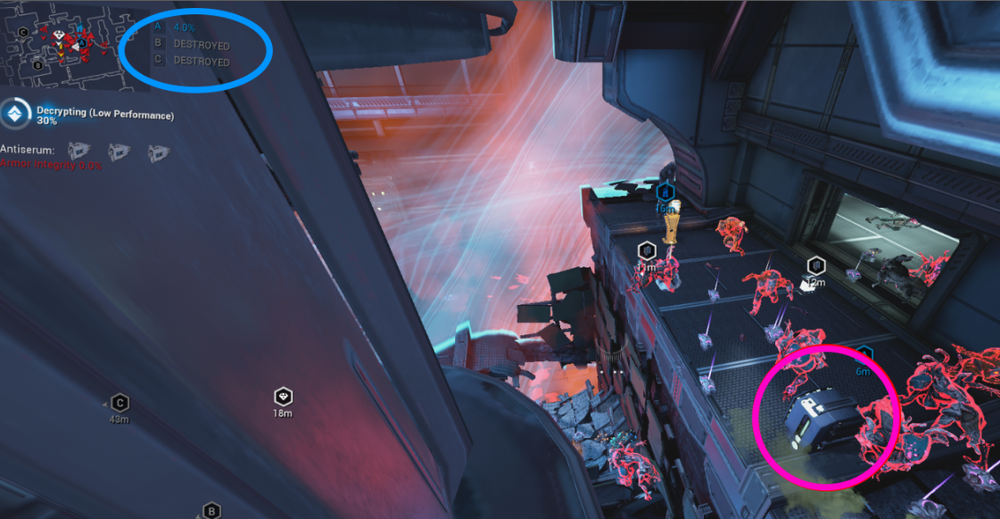
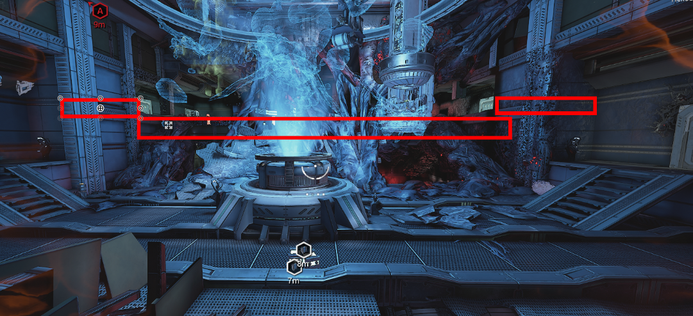
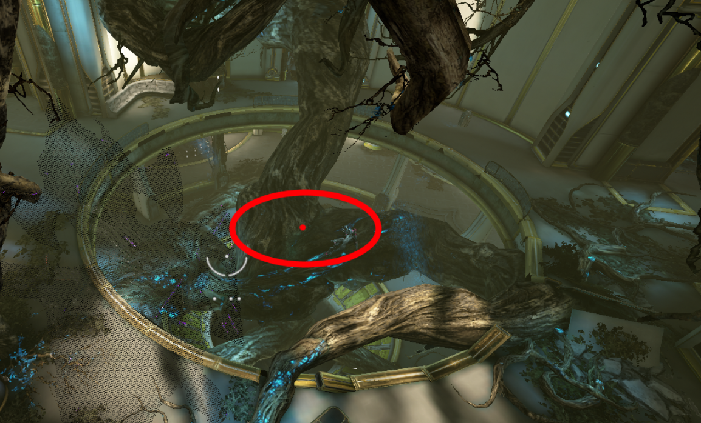
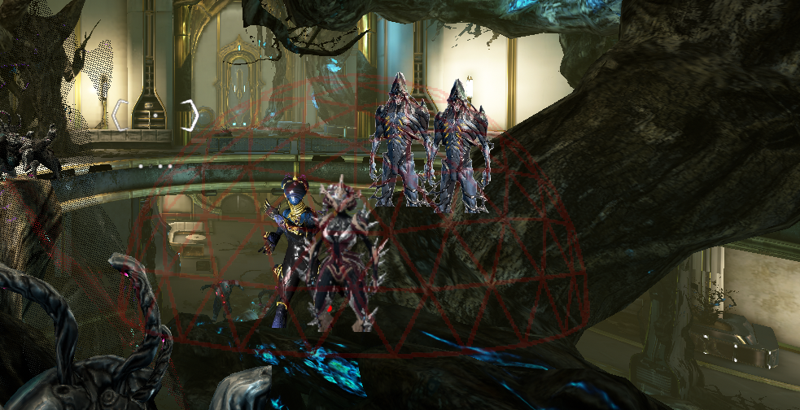
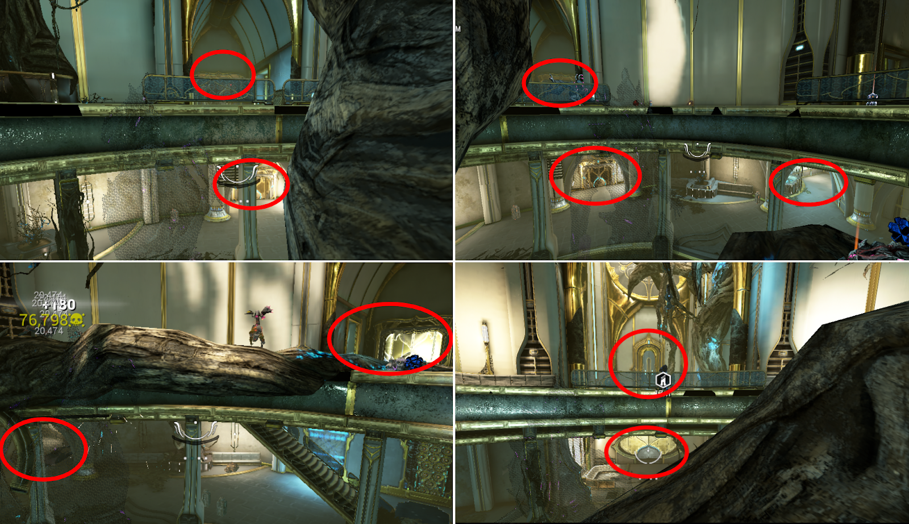
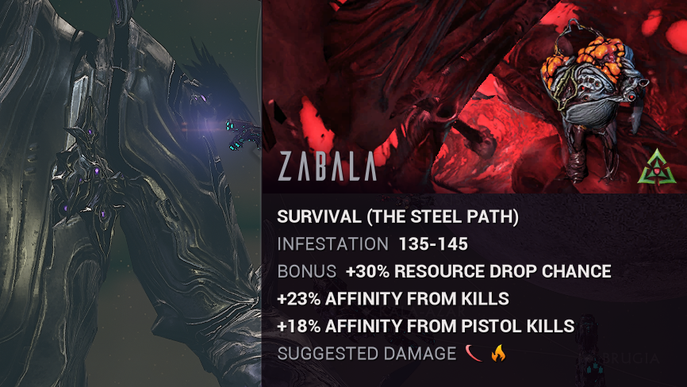
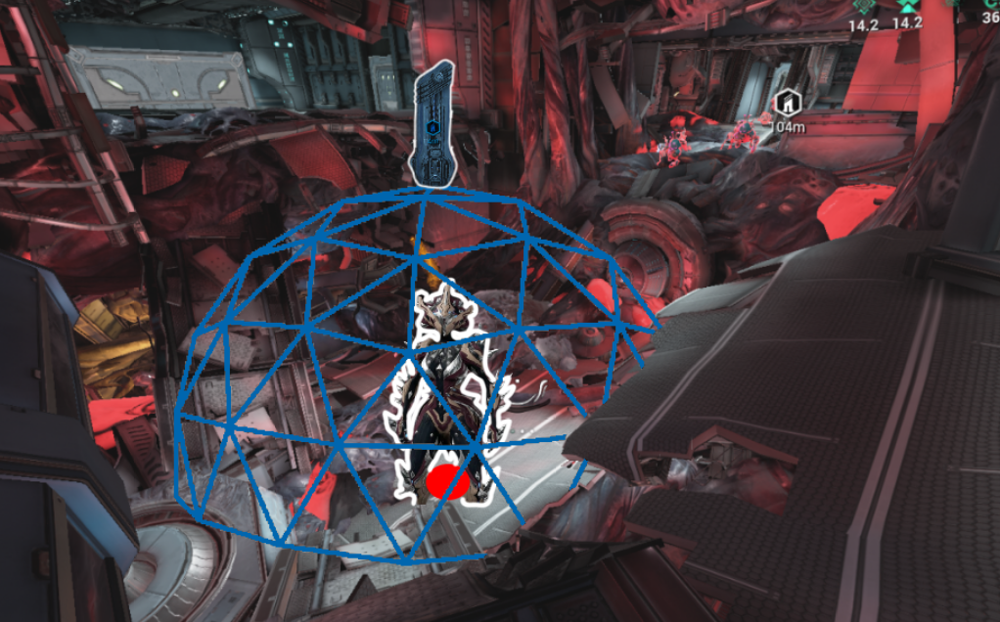
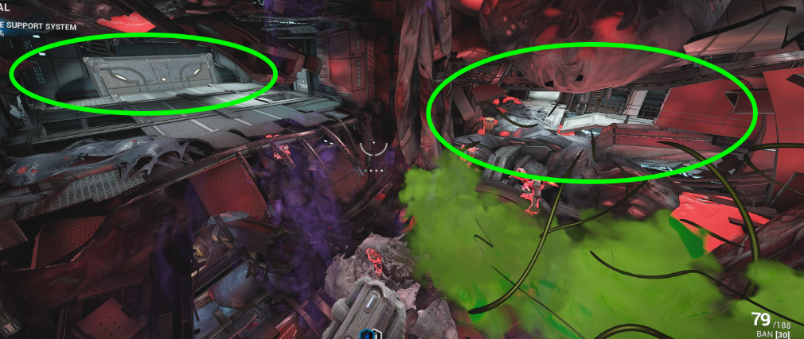

# <u><strong> NANOSPORE</strong></u>

## <u><strong> Oestrus — Eris — Infested Salvage - Origin System </strong></u>

- **Squad:** 4/4  
- **Composition:** 1 [Khora](../builds/khoraSteelPath.md) · 1 [Nova](../builds/novaosSp.md) · 2 [Nekros](../builds/nekrososSp.md)

---

:::tip
We won't be playing in **SP mode**, we just want the **cage to kill mobs**.  
You can play in SP if you like — the **method and builds** will be the same for **Nova** and **Nekros**, but **not for Khora**.  
:::

>  It is recommended that all squad members play **Power Donation**. 

 

   
 

### <u> <strong> Tile Sets </strong> </u> 

Here is the location or mission we use to collect nano spores. **Two tile sets** are available: **one that we want** and the other that we ignore .To distinguish the room, we use a **key indicator**; 

>  [!IMPORTANT]
> At the start of the mission, two waypoints will appear. 
>
> If you only see one waypoint,( to the left of the screen) abort the mission and restart it until you see two waypoints ( to the right of the screen )

 

   
 

Once you have found the correct tile set, **one player needs to break a crate** (other than the host) should leave the mission.  
Then the host should **re-invite the player**. This will cause **more enemies to spawn**. 

::: danger ATTENTION
**2024.10 Koumei & The Five Fates
 Now, the two yellow markers that used to indicate the correct tile are gone, so you'll need to manually check the tile each time**
:::

### <u> <strong> Method OS  </strong> </u>

::: danger ATTENTION 
**2024.10 Koumei & The Five Fates**
**You have to place the first two serums in one console (in this case, A) to get mobs to spawn; otherwise, nothing spawns**
:::

- Once the mission starts, three consoles (A, B, C) appear.  
- **Keep only Console A active** — destroy B and C.  
- Let A **degrade slowly**, then **use antivirus serum at ~7% health**.  
- **Nekros** must watch the console’s health (shown near the mini-map).

:::details Why 
The reason we do this is to make the mission progress as slowly as possible to maximize the acquisition of nano spores. The method involves letting console A degrade., 
then start applying antivirus serum whenever the console reaches ~7% health.
:::

   

### <u> <strong> Position / Role </strong> </u> 

Usually , [Khora](../builds/khoraOrigin.md) **will place her cage as shown on the image below**, but she can also place it as in the other images. 

This doesn't really impact the loot at the end. The rest of the squad will always remain in the [Khora](../builds/khoraOrigin.md) cage, 

:::warning 
**NEVER USE THE CENTRAL CONSOLE**
:::

   

Some textures are considered transparent; we can use [Nekros Rage](../builds/nekrososSp.md) through them directly without needing a direct line of sight to the enemy.

   

[Khora](../builds/khoraOrigin.md) is the main source of DPS and loot. She will kill  the ennemies with her cage. 
Her role in the mission is simple : 
- Place cage in the right spot
- Set venari to "Heal" on an ally to prevent them from running around and blocking mobs
- Spam [**__Magus Anomaly__**](https://wiki.warframe.com/w/Magus_Anomaly)

[Nova](../builds/novaosSp.md) **will increase the speed of the enemies** so they run directly into Khora's cage. 
In the mission, 
- Press 4 to boost the mobs' speed, and that's it. 
- Can spam [Magus Anomaly](../builds/operator.md#magus-anomaly) 
- Use the Helminth ability she has equipped (quiver, pull, dispensary, rage).  

[Nekros](../builds/nekrososSp.md)  **allows us to re-loot killed mobs with his ability** **Desecrate**, increasing our resource gains. 
-  Cast third ability (*Desecrate*) 
- Use Rage, his Helminth ability, to boost the mobs's  speed and their susceptibility to damage.

## <u> <strong> Terrorem - Deimos - Survival - Steel Path </strong> </u>

- **Squad:** 4/4  
- **Composition:** 1 [Khora](../builds/khoraSteelPath.md) · 1 [Nova](../builds/novaosSp.md) · 2 [Nekros](../builds/nekrososSp.md)

   

### <u> <strong> Tile Sets </strong> </u> 

**Good Tile :** 
:::info
*There is no visual indicator to know if you are on the correct map; you have to do it manually and search for the right tile or use an Analyzer or another tool*
:::

### <u> <strong> Method SP </strong> </u> 
[Khora](../builds/khoraSteelPath.md) should place her Strangledome exactly as shown in the screenshot below.

   

- [Nova](../builds/novaosSp.md) will press 4 to **speed up** ennemies  so they quickly get trapped inside the dome.
She can also use her subsumed ability (**Rage or Cloak**), but it's optional.

- [Nekros](../builds/nekrososSp.md) will use Desecrate to re-roll enemy drops and increase loot.

Among the two Nekros, one **must** use  — this is mandatory.
 The second Nekros can choose to run something else, such as [Pull](../builds/nekrososSp.md#pull), [Rage](../builds/nekrososSp.md#rage), or [Petrify](../builds/nekrososSp.md#petrify), depending on preference.

All squad members should stay grouped together at the designated location (as shown in the screenshots below).

   

*SPAWN LOCATION FOR NEKROS PULL*

   

### <u> <strong> Position - Role </strong> </u> 

[Khora](../builds/khoraSteelPath.md) is the main source of DPS and loot.
-  Kill enemies with her whip [Steel Path Build](../builds/khoraSteelPath.md#khora-steel-path)
- Wait for the enemies to be petrified; **do not spam the ability**.
- Place her cage in the right spots,
- Set Venari to 'Heal' on an ally to prevent them from moving around and blocking enemies.

[Nova](../builds/novaosSp.md) will increase the speed of the enemies so they run directly into Khora's cage. 
- Press 4 to boost the enemies' speed, 
- Can also spam [Magus Anomaly](../builds/operator.md#magus-anomaly).

[Nekros](../builds/nekrososSp.md) allows us to re-loot killed enemies with his ability **Desecrate**, thus increasing our resource gains.
In the mission, Nekros will use his 3 (Desecrate) and his Helminth ability:

- [Pull](../builds/nekrososSp.md#pull) to bring enemies into the cage or unstick them, 
- [Petrify](../builds/nekrososSp.md#petrify) for additional loot (Khora needs to wait for your petrification before killing the enemies). *This method is much harder to set*

## <u> <strong> Zabala - Eris - Survival (Dark Sector) - Steel Path </strong> </u> 

- **Squad:** 4/4  
- **Composition:** 1 [Khora](../builds/khoraSteelPath.md) · 1 [Nova](../builds/novaosSp.md) · 2 [Nekros](../builds/nekrososSp.md)

   

### <u> <strong> Tile Sets </strong> </u> 

**Good Tile :** 
:::info
*There is no visual indicator to know if you are on the correct map; you have to do it manually and search for the right tile or use an Analyzer or another tool*
:::

### <u> <strong> Method SP </strong> </u> 

- [Khora](../builds/khoraSteelPath.md) will place her cage approximately in the same spot as shown in the screenshot.

[Nova](../builds/novaosSp.md) will need to place a med tower above the cage.
[Nekros](../builds/nekrososSp.md) will stand on the med tower and use Pull.
[Nova](../builds/novaosSp.md)will put cloak on the med tower to prevent the [Nekros](../builds/nekrososSp.md) from being targeted by the mobs.

We can place one [Nekros Pull](../builds/nekrososSp.md#pull) on the med tower and keep one [Nekros Petrify](../builds/nekrososSp.md#petrify) near the cage; he will petrify the enemies each time the mobs are pulled into the cage.

   

*SPAWN LOCATION FOR NEKROS PULL*

   

   

*TOWER PLACEMENT WITH NOVA*

- Double Jump
- AimGlide  - Down
- Press Antimatter keybind
- Press MedTower keybind 
>TODO : Ajouter  la video de nova 

*To get the med tower, you just need to obtain the MANTIS.*
*Then press Escape  ➛ Orbiter  ➛ Landing Craft  ➛ Air Support  ➛ Select Med-Tower*

*Position Nekros Pettrify*

>TODO : Ajouter la video de Nekros petrify 

### <u> <strong> Position - Role </strong> </u> 

[Khora](../builds/khoraSteelPath.md) is the main source of DPS and loot.
- Kill enemies with her whip [Steel Path](../builds/khoraSteelPath.md).
- Wait for the enemies to be petrified; do not spam the ability.
- Place her cage in the right spots,
- Set Venari to 'Heal' on an ally to prevent them from moving around and blocking enemies.

[Nova](../builds/novaosSp.md) will increase the speed of the enemies so they run directly into Khora's cage. 
-  Press 4 to boost the enemies' speed, 
- Place her med tower for the **Nekro**s while granting them invisibility with [Quiver](../builds/novaosSp.md#quiver). 
- Can spam Magus Anomaly.

[Nekros](../builds/nekrososSp.md) allows us to re-loot killed enemies with his ability **Desecrate** thus increasing our resource gains.
- Use third ability (Desecrate) and his Helminth ability:
- [Pull](../builds/nekrososSp.md#pull) to bring enemies into the cage or unstick them, 
- [Petrify](../builds/nekrososSp.md#petrify) for additional loot (Khora needs to wait for your petrification before killing the enemies). *This method is much harder to set up*