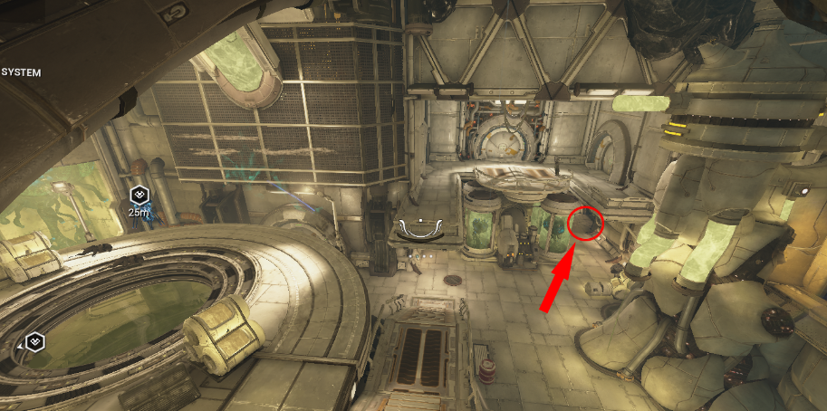
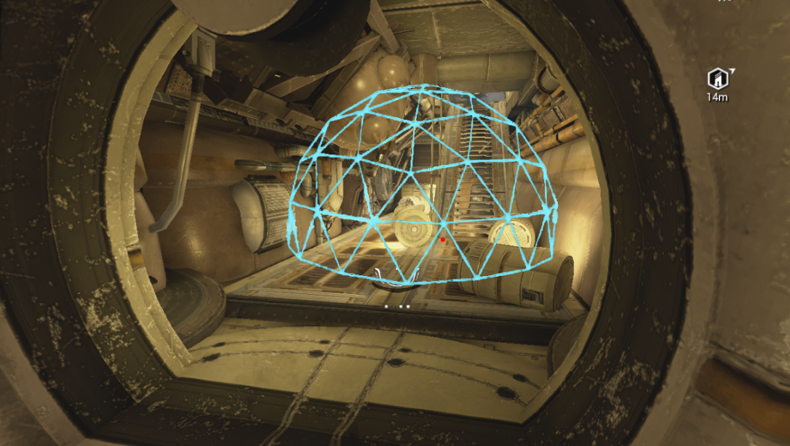
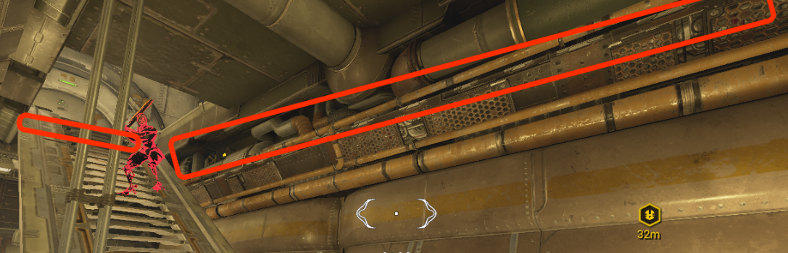
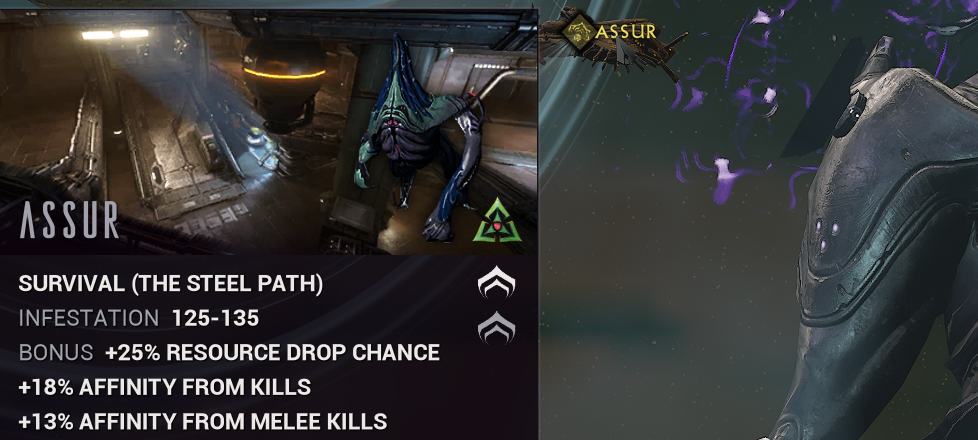
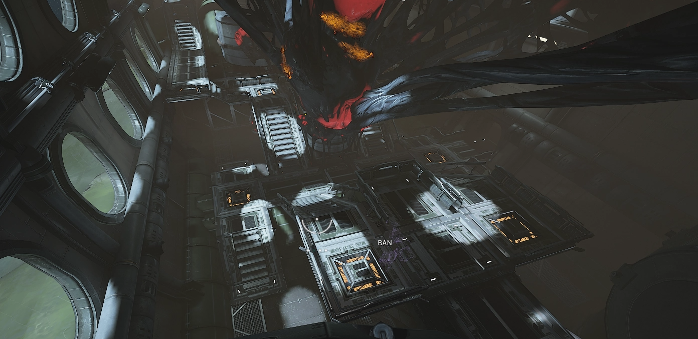
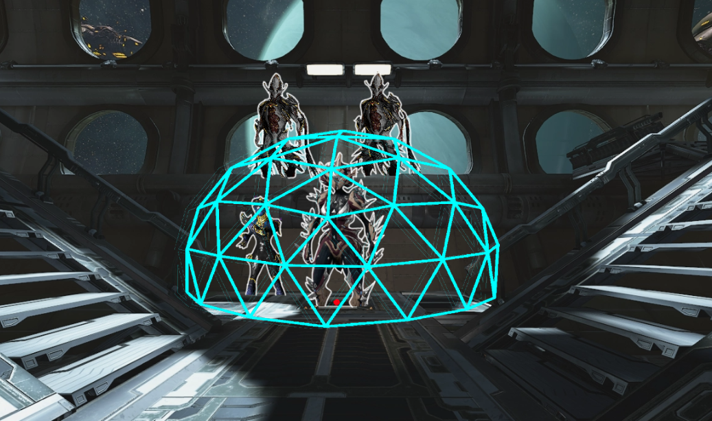

# <u> <strong> Polymer </strong> </u> 

##  <u> <strong> Ophelia - Uranus - Survival (Sumbersible) - Origin System - Steel Path </strong> </u> 

- **Squad:** 4/4  
- **Composition:** 1 [Khora](../builds/khoraSteelPath.md) · 1 [Nova](../builds/novaosSp.md) · 2 [Nekros](../builds/nekrososSp.md)

   

### <u> <strong> Tile Sets </strong> </u>

**Good Tile :** 
:::info
*There is no visual indicator to know if you are on the correct map; you have to do it manually and search for the right tile or use an Analyzer or another tool*
:::

   

### <u> <strong> Method Origin System </strong> </u> 

Enter through this door indicated by the red circle, you will be taken to a small room with a staircase, [Khora](../builds/khoraOrigin.md) will have to put the cage (where it is indicated on the picture). 

   

**The remainder of the game is simple:**
- If you are playing in (OS), [Khora](../builds/khoraOrigin.md) kills the enemies with her cage, [Nekros](../builds/nekrososSp.md) uses **Desecrate + Pull/Rage**, and [Nova](../builds/novaosSp.md )speeds up the enemies. 
- Extract  when Khora can't kill anymore with her  cage (around 30-35 minutes).

- If you are in (SP), [Khora](../builds/khoraSteelPath.md) kills the enemies trapped in the cage with her whipclaw, and the role of [Nekros](../builds/nekrososSp.md) and [Nova](../builds/novaosSp.md) remains unchanged

:::tip
- We can use **Rage**  (Helminth) on certain textures that the game considers transparent, which is useful for boosting enemies without having direct line of sight on them

   

- Enemies will get stuck there (as shown in the image). All you have to do, just press "pull" (Helminth) them out

   

 

- The issue we regularly encounter at the farming spot is this: enemies often get stuck at this location. You'll need to kill them quickly to refresh their spawn

   

### <u> <strong> Method Steel Path </strong> </u> 

- [Khopra](../builds/khoraSteelPath.md) puts her dome in the place indicated by the red circle
- [Nekros](../builds/nekrososSp.md#pull) pulls enemies that are within the green circles.
- A [Nekros](../builds/nekrososSp.md#rage) with Rage will be very useful, as there are many transparent textures that he can exploit to speed up the enemies
- [Nova](../builds/novaosSp.md#quiver) will increase mob speed and make the squad invisible with **Quiver**

   

### <u> <strong> Position - Role </strong> </u> 

[Khora](../builds/khoraOrigin.md) is the main source of DPS and loot. 

- Kill enemies with her cage in the [Origin System](../builds/khoraOrigin.md) and with the whip if you play in [Steel Path](../builds/khoraSteelPath.md).
- Place her cage in the right spots,
- Set Venari to 'Heal' on an ally to prevent them from running around and blocking enemies

[Nova](../builds/novaosSp.md) will increase the speed of the enemies so they run directly into Khora's cage. 
In the mission, 
-  Press 4 to boost the mobs' speed, and that's it. 
- Can spam [Magus Anomaly](../builds/operator.md#magus-anomaly) 
- Use the Helminth ability she has equipped (e.g. quiver, rage).

[Nekros](../builds/nekrososSp.md) allows us to re-loot killed enemies with his ability **Desecrate**, thus increasing our resource gains.
- Cast third ability  (Desecrate) and his Helminth ability, Rage, to increase the speed of the enemies and their vulnerability to damage.

- Alternatively, he can use **Pull** to bring the enemies into the cage or to unstick them.
*It is always preferable to have one Nekros with [Pull](../builds/nekrososSp.md#pull) and one Nekros with [Rage](../builds/nekrososSp.md#rage) in the team*

## <u> <strong> Assur - Uranus - Survival (Dark Sector) - Steel Path </strong> </u> 

- **Squad:** 4/4  
- **Composition:** 1 [Khora](../builds/khoraSteelPath.md) · 1 [Nova](../builds/novaosSp.md) · 2 [Nekros](../builds/nekrososSp.md)

   

### <u> <strong> Tile Sets </strong> </u> 

**Good Tile :** 
:::info
*There is no visual indicator to know if you are on the correct map; you have to do it manually and search for the right tile or use an Analyzer or another tool*
:::

   

### <u> <strong> Method Steel Path </strong> </u> 

- [Khora SP](../builds/khoraOrigin.md) puts her dome in the place indicated by the red point on the image below
- [Nekros Pulls](../builds/nekrososSp.md#pull) enemies in the dome
- [Nekros Petrify](../builds/nekrososSp.md#petrify) will be very useful, for even more resources
- [Nova Rage](../builds/novaosSp.md#rage) on enemies for Damage Vulnerability and movement speed
- [Nova Quiver](../builds/novaosSp.md#quiver) makes mobs aggro on you and shoot from a distance, causing them to stay in a fixed spot and not move.

   

*Mob Spawn Location Nekros POV* 

   

### <u> <strong> Position - Role </strong> </u> 

[Khora](../builds/khoraSteelPath.md) is the main source of DPS and loot.
 - Kill enemies with her whip [Steel Path](../builds/khoraSteelPath.md).
- Wait for the enemies to be petrified; do not spam the ability.
- Place her cage in the right spots,
- Set Venari to 'Heal' on an ally to prevent them from moving around and blocking enemies.

[Nova](../builds/novaosSp.md) will increase the speed of the enemies so they run directly into Khora's cage.
 - Press 4 to boost the enemies' speed, and that's it.
- Can spam [Magus Anomaly](../builds/operator.md#magus-anomaly)
- Can use the Helminth ability she has equipped (quiver, rage).

[Nekros](../builds/nekrososSp.md) allows us to re-loot killed enemies with his ability  **Desecrate**, thus increasing our resource gains.

- Cast third ability  (Desecrate) and his Helminth ability:
- [Pull](../builds/nekrososSp.md#pull) to bring enemies into the cage or unstick them.
- [Petrify](../builds/nekrososSp.md#petrify) for additional loot (Khora needs to wait for your petrification before killing the enemies). *This method is much harder to set up*

