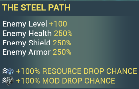
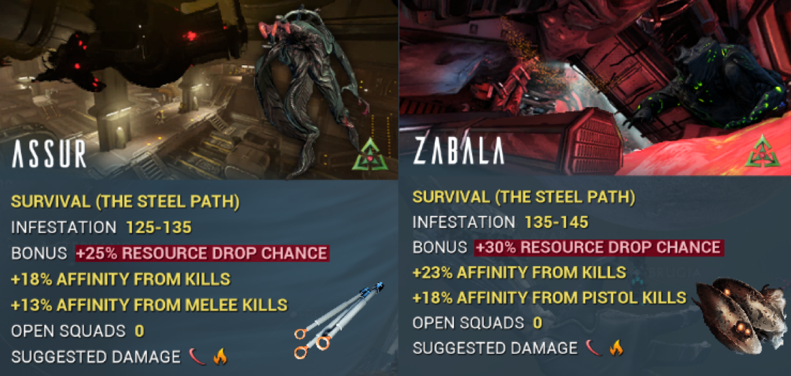

# Mission Conditions

## Booster - Blessing : 

  

- The host or Client needs a **drop chance booster** on the market, but it's always useful to have one if you're migrating host or starting a squad. 
- This booster is cumulative with the **drop chance blessing**. It is also recommended that everyone has a market **resource booster**.  

## Steel Path 

- All Steel Path missions benefit from a **+100% increase in resource drop chance** and a **+100% increase in mod drop chance** .
- This is cumulative with your booster, so starting on SP is usually the most viable option

    

## Fissure 

Endless Missions:
- Void Fissure missions survival have bonus rewards per rotation if the player collects enough Reactant:

1. 1.25x Affinity Booster
2. 1.25x Credit Booster
3. **1.25x Resource Booster**
4. **1.25x Resource Drop Chance Booster**
5. One random Exceptional Relic of the mission's relic tier
6. 1.5x Affinity Booster
7. 1.5x Credit Booster
8. **1.5x Resource Booster**
9. **1.5x Resource Drop Chance Booster**
10. One random Flawless Relic of the mission's relic tier
- **Boosters will continue to increase by 0.25x up to a cap of 2x, occurring at the nineteenth interval.**

## Dark Sector 

Dark Sectors are unique parts of the Star Chart, uninhabited by most civilizations and controlled by the Infested, regardless of the faction controlling the planet.

Each Dark Sector node is an endless mission with a higher credit payout, increased resource drop rate, and increased affinity from kills 

    

## Solo - Squads

**It is recommended to play with a full squad to increase mob spawns**, take advantage of your Nekros' Desecrates, and therefore obtain significantly more loot at the end of your mission.

*However,*

you are free to complete the missions solo , [Khora](../builds/khoraOrigin.md) will be the most efficient choice for this, but in any case, you will be far less profitable compared to a full squad.

::: tip
##   [*__SPREADSHEET__*](https://docs.google.com/document/d/1ufDAAV7SEU0UBG05x9STuzWOO1WhoZ1gWVm20n7pSvw/edit?tab=t.0) 

**This table refers to all the tests I’ve been able to do (even if I don’t always remember to fill it in)**

