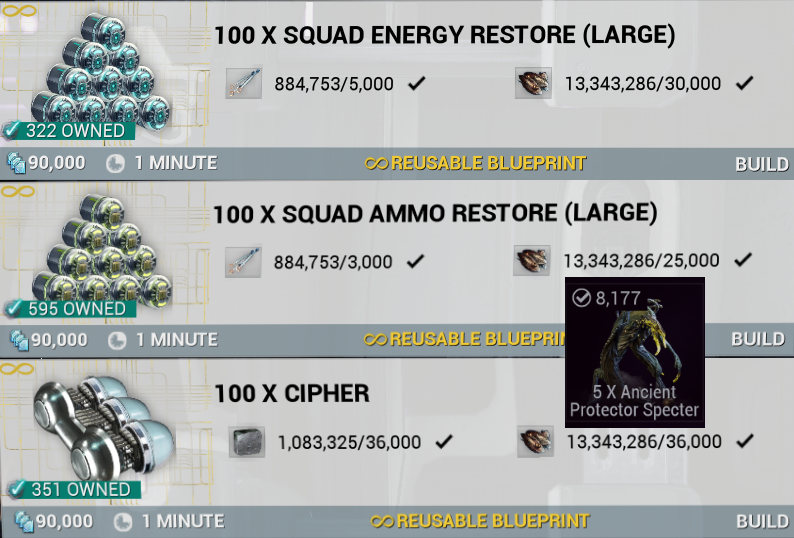

# Why ? 

### Now you might ask yourself why would a NPF guide be any usefull 

The answer is simple: it's the resources we need to do all the endgame activities. Endgame players will always need these Gear supplies

- **Arbitration**: Squad Restore / Specter
- **Cascade**: Squad Restore
- **Aya**: Squad Restore / Cipher
- **Eidolon**: Squad Restore / Ancient Healer / Cipher 
- **Profit Taker**: Squad Restore 
- **Speedrun Spy**: Cipher

